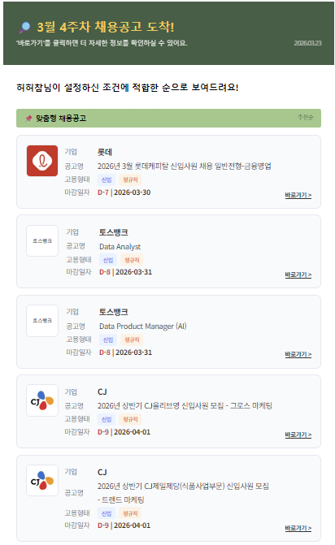

# 🚀 Job Finder Recommendation

사용자 선호 정보를 기반으로 채용 공고를 추천하는 프로젝트입니다.  
유저 온보딩 단계에서 유저의 선호도를 Google Forms로 수집하고, 채용 공고는 크롤링 및 전처리된 데이터를 로드해 사용합니다.  
유저와 공고를 각각 정규화하고, 유저의 선호도에 맞게 공고를 매칭/필터링합니다.  
이후 모든 유저에게 **맞춤형 추천(Personalized)** 과 **탐색형 추천(Explore)** 을 제공합니다.



<br>

## 🔄 전체 흐름

1. 공고 데이터 로드
2. 수시채용 공고를 구글시트로 분리 및 재적재
3. 사용자 응답 데이터 로드
4. 공고 / 사용자 데이터 정규화
5. 추천 엔진 실행
6. 추천 결과 CSV 저장
<br>

## 📊 데이터

| 구분 | 수집 방식 | 저장 위치 | 활용 방식 |
|---|---|---|---|
| 사용자 데이터 | Google Form을 통해 사용자 개인정보 및 선호도 수집 | Google Sheets | 사용자 선호 기반 추천 조건 생성에 활용 |
| 공고 데이터 | 크롤링/전처리 팀이 공고를 수집 및 전처리([job-finder-crawling](https://github.com/ai-crews/job-finder-crawling)) | Google Sheets | 추천 대상 공고 로드 및 필터링/추천에 활용 |  
<br>

## 🧠 추천 알고리즘

추천은 **맞춤형 추천(Personalized)** 과 **탐색형 추천(Explore)** 두 레이아웃으로 나누어 제공합니다.  
맞춤형 추천에서 탈락한 공고들에 대해 탐색형 추천을 구성해 유저가 다양한 공고를 탐색할 수 있습니다.

모든 추천은 **하드 필터 → 소프트 조건 점검 → 추천 생성** 순서로 동작합니다.

### 1️⃣ 하드 필터
추천 대상에서 제외할 공고를 먼저 걸러냅니다.

> `마감일 필터` : 추천일 기준 공고 마감일까지 1일 초과 30일 이하 남은 공고만 필터링  
> `희망 직무 필터` : 사용자의 희망 직무 Top3와 일치하는 공고만 필터링  
> `학력 필터` : 사용자의 선호 학력 조건과 공고의 학력 요건이 맞는 경우만 필터링  
> `어학 점수 필터` : 어학 점수가 필요한 공고는 어학 점수를 보유한 사용자에게만 필터링  
> `경력 필터` : 경력직 전용 공고는 제외하고, 신입 또는 경력무관 공고를 중심으로 필터링

### 2️⃣ 소프트 필터
하드 필터를 통과한 공고에 대해 아래 조건의 일치 여부를 기록합니다.

> `고용 형태` : 사용자의 선호 고용 형태와 공고의 고용 형태 일치 여부를 확인  
> `기업 규모` : 사용자의 선호 기업 규모와 공고의 기업 규모 일치 여부를 확인  
> `산업군` : 사용자의 선호 산업군과 공고의 산업군 일치 여부를 확인

### 3️⃣ 추천 생성

#### 맞춤형 추천 Personalized
> 소프트 조건까지 모두 맞는 공고를 추천합니다.

#### 탐색형 추천 Explore
> 하드 필터는 통과했지만 소프트 필터에서 필터링된, 일부 선호 조건이 다른 공고를 추천합니다.  

### 4️⃣ 정렬

유저의 선호 정렬 기준을 바탕으로 추천 공고를 정렬합니다.

#### 맞춤형 추천 Personalized (개수 제한 X)
> `마감임박순` : 마감일 오름차순 정렬  
> `추천순` : 희망 직무 우선순위 → 마감일 오름차순 정렬 

#### 탐색형 추천 Explore (최대 5개)
> 소프트 필터 불일치 개수 오름차순으로 정렬하며, 불일치 1개 → 2개 → 3개 순
<br>

## 📂 코드 구조

```text
job-finder-rec/
├── data/
│   └── sample/                     # 샘플 공고 데이터
│
├── src/
│   └── job_finder_rec/
│       ├── data/
│       │   ├── forms/
│       │   │   ├── sheets_reader.py  # 사용자 설문 응답 로드
│       │   │   └── user_adapter.py   # 사용자 응답 데이터를 추천용 포맷으로 변환
│       │   │
│       │   ├── jobs/
│       │   │   ├── sheets_reader.py  # 공고 데이터 로드 및 수시채용 시트 적재
│       │   │   └── job_adapter.py    # 공고 데이터를 추천용 객체로 변환
│       │   │
│       │   └── sheets_auth.py        # Google Sheets 인증 처리
│       │
│       └── recommender/
│           ├── engine.py             # 추천 전체 흐름 제어
│           ├── explore.py            # 탐색형 추천 생성
│           ├── filter.py             # 하드 필터 / 소프트 조건 점검
│           ├── personalized.py       # 맞춤형 추천 생성
│           ├── types.py              # 추천 관련 데이터 구조 정의
│           └── utils.py              # 공통 유틸 함수
│
├── .env_sample                       # 환경변수 예시 파일
├── main.py                           # 전체 추천 파이프라인 실행
└── README.md                         # 프로젝트 문서
```
<br>

## ⚙️ 초기 세팅

### 1. 가상환경 생성
```bash
python -m venv .venv
source .venv/bin/activate
# Windows: .venv\Scripts\activate
```

### 2. 패키지 설치
```bash
pip install python-dotenv gspread google-auth pandas openpyxl
```

### 3. 환경변수 설정
`.env` 파일을 생성하고 아래 값을 설정합니다.

```env

USER_SPREADSHEET_ID=
USER_WORKSHEET_NAME=

JOB_SPREADSHEET_ID=
JOB_WORKSHEET_NAME=

ROLLING_RECRUITMENT_SPREADSHEET_ID=
ROLLING_RECRUITMENT_WORKSHEET_NAME=
```

### 4. 시트 권한 공유
Service Account 이메일을 사용자 / 공고 / 수시채용 시트에 공유해야 합니다.

<br>

## ▶️ 실행 방법

```bash
python main.py
```

실행 후 추천 결과는 `output/` 폴더에 CSV 파일로 저장됩니다.

<br>

## 📦 출력 결과

추천 결과는 `output/recommendations_YYYYMMDD_HHMMSS.csv` 형태로 저장되며, 1행 = 1공고 구조입니다.  
